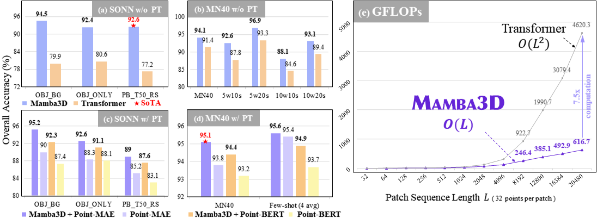

# Mamba3D 

[](https://paperswithcode.com/sota/supervised-only-3d-point-cloud-classification?p=mamba3d-enhancing-local-features-for-3d-point)
[](https://paperswithcode.com/sota/3d-point-cloud-classification-on-modelnet40?p=mamba3d-enhancing-local-features-for-3d-point)
[](https://paperswithcode.com/sota/3d-point-cloud-classification-on-scanobjectnn?p=mamba3d-enhancing-local-features-for-3d-point)

This repository contains the official implementation of the paper:

[**[ACM MM 24] Mamba3D: Enhancing Local Features for 3D Point Cloud Analysis via State Space Model**](https://arxiv.org/abs/2404.14966)


## 📰 News
- [2024/8] We've slightly optimized the architecture, such as some normalization layers and hyperparameters, thus improving the accuracy of the model after pre-training.
- [2024/8] We release the training and evaluation code! Pretrained weights are coming soon!
- [2024/7] Our [MiniGPT-3D](https://github.com/tangyuan96/minigpt-3d) is also accepted by ACM MM24! We outperform existing large point-language models, using just about 1 day on 1 RTX 3090! Check it out!
- [2024/7] Ours Mamba3D is accepted by ACM MM24!

- [2024/4] We present Mamba3D, a state space model tailored for point cloud learning.
<div style="text-align: center">

</div>

- [2024/4] Mamba3D surpasses Transformer-based counterparts and concurrent works in multiple tasks, achieving multiple SoTA, with linear complexity.
<div style="text-align: center">

</div>


## 📋 TODO
- [x] Release the training and evaluation code
- [ ] Release the pretrained weights
- [ ] Release the toy code on Colab


## 🎒 1. Requirements
Tested on:
PyTorch == 1.13.1;
python == 3.8;
CUDA == 11.7

```
pip install -r requirements.txt
```

```
# Chamfer Distance & emd
cd ./extensions/chamfer_dist
python setup.py install --user
cd ./extensions/emd
python setup.py install --user
# PointNet++
pip install "git+https://github.com/erikwijmans/Pointnet2_PyTorch.git#egg=pointnet2_ops&subdirectory=pointnet2_ops_lib"
# GPU kNN
pip install --upgrade https://github.com/unlimblue/KNN_CUDA/releases/download/0.2/KNN_CUDA-0.2-py3-none-any.whl

# Mamba install
pip install causal-conv1d==1.1.1
```

More detailed settings can be found in [mamba3d.yaml](./mamba3d.yaml).

## 🧾 2. Datasets 

We use ShapeNet, ScanObjectNN, ModelNet40 and ShapeNetPart in this work. See [DATASET.md](./DATASET.md) for details.


## 🍔 3. Mamba3D Pre-training 
To pre-train Mamba3D on ShapeNet, run:

```
bash script/run_pretrain.sh

# or

CUDA_VISIBLE_DEVICES=<GPU> python main.py --config cfgs/pretrain.yaml --exp_name <output_file_name>
```
## 🥧 4. Mamba3D Fine-tuning 

To fine-tune Mamba3D on ScanObjectNN/Modelnet40, run:
```
#Note: change config files for different dataset
bash run_finetune.sh
```

To vote on ScanObjectNN/Modelnet40, run:
```
#Note: change config files for different dataset
bash run_vote.sh
```
Few-shot learning, run:
```
bash run_fewshot.sh
```


## 😊 Acknowledgement
We would like to thank the authors of [Mamba](https://github.com/state-spaces/mamba), [Vision Mamba](https://github.com/hustvl/Vim), and [Point-MAE](https://github.com/Pang-Yatian/Point-MAE) for their great works and repos.

## 😀 Contact
If you have any questions or are looking for cooperation in related fields, please contact [Xu Han](https://xhanxu.github.io/) via xhanxu@hust.edu.cn. 

## 📚 Citation
If you find our work helpful, please consider citing:
```bibtex
@article{han2024mamba3d,
  title={Mamba3D: Enhancing Local Features for 3D Point Cloud Analysis via State Space Model},
  author={Han, Xu and Tang, Yuan and Wang, Zhaoxuan and Li, Xianzhi},
  journal={arXiv preprint arXiv:2404.14966},
  year={2024}
}
```
